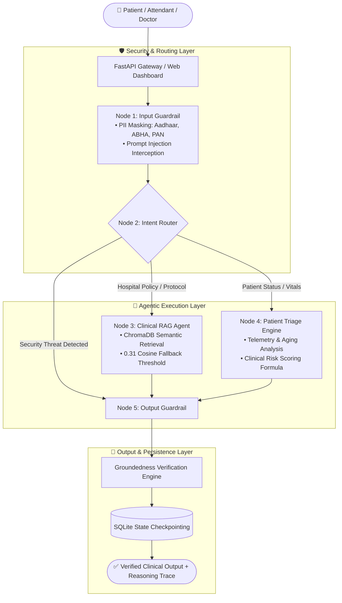

<div align="center">

# 🩺 PulseAI — Autonomous Healthcare Operations & Clinical RAG Copilot
### **Enterprise-Grade Clinical Triage, Protocol RAG & DPDP-Compliant Privacy Engine**

[](https://www.python.org/)
[](https://fastapi.tiangolo.com)
[](https://github.com/langchain-ai/langgraph)
[](https://www.trychroma.com)
[-brightgreen.svg?logo=pytest&logoColor=white)]()
[]()
[](LICENSE)
[]()

<br/>

**PulseAI** is a production-minded Autonomous Clinical Operations Copilot built for super-specialty hospitals, emergency departments, and patient relations. It combines **LangGraph multi-node state orchestration**, **dual-collection ChromaDB vector retrieval**, **continuous mathematical clinical risk scoring**, and **real-time Indian PII masking** to deliver safe, grounded, and life-critical healthcare assistance.

<br/>

[🌟 Features](#-key-features) • [🏛️ System Architecture](#️-system-architecture) • [📐 Risk Scoring Model](#-continuous-clinical-risk-scoring) • [🖥️ Dual-Perspective UI](#️-dual-perspective-dashboard) • [🚀 Quickstart](#-quickstart--installation) • [📡 API Reference](#-api-endpoints)

---

</div>

## 🌟 Key Features

### 1. 🧠 5-Node LangGraph State Machine
* **`input_guardrail`**: Intercepts queries, applies regex masking for Indian PII identifiers, and defends against adversarial prompt injections.
* **`intent_router`**: Evaluates sanitized input and dynamically dispatches execution across `PATIENT_TRIAGE`, `CLINICAL_RAG`, or `GUARDRAIL_BLOCKED`.
* **`rag_agent`**: Queries ChromaDB vector collections with sentence-based embeddings and handles out-of-scope inquiries with polite, humble fallbacks.
* **`patient_triage`**: Looks up real-time vital signs and executes the continuous clinical risk formula.
* **`output_guardrail`**: Computes output groundedness against retrieved context and persists session history to structured audit logs.

### 2. 🏥 Autonomous Patient Triage & ICU Escalation
* Evaluates patient telemetry: **$\text{SpO}_2$ percentage**, **Heart Rate (bpm)**, **Systolic BP (mmHg)**, and **Days Admitted**.
* Computes continuous clinical risk scores ($[0.0, 1.0]$) and triggers **Immediate Chief Medical Officer (CMO) / Level 1 ICU Escalations** for scores $\ge 0.65$.

### 3. 🔒 DPDP & HIPAA-Compliant Privacy Guardrails
* Automatic real-time regex sanitization for:
  - **Aadhaar Numbers**: `XXXX XXXX XXXX`
  - **ABHA Digital Health IDs**: `XX-XXXX-XXXX-XXXX`
  - **PAN Cards**: `[A-Z]{5}[0-9]{4}[A-Z]{1}`
  - **Indian Phone Numbers**: `+91 / 10-digit mobile`
* Masking occurs **in-memory before vector search, tool calling, and audit logging**.

### 4. ⚡ Dual-Chunking ChromaDB Vector RAG
* Compares **Fixed-Size with Overlap** (220 chars / 40 overlap) against **Sentence-Based Semantic Chunking**.
* Employs calibrated cosine distance fallback ($0.31$ similarity cutoff) to prevent hallucinations.

### 5. 💾 Fault-Tolerant SQLite Checkpointing & MCP
* State persistence using SQLite checkpointers, allowing sessions to pause before tool execution and resume without state loss.
* Model Context Protocol (FastMCP) standard tool exposure.

---

## 🏛️ System Architecture



---

## 📐 Continuous Clinical Risk Scoring

Emergency triage prioritization uses a continuous dual-component mathematical model:

$$\text{Clinical Risk Score} = (\text{flagged\_for\_critical\_icu\_review} \times 0.50) + \left(\frac{\min(\text{days\_admitted}, 30)}{30} \times 0.50\right)$$

### Decision Boundary Matrix
| Score Range | Clinical Severity Tier | Protocol & Escalation SLA |
| :--- | :--- | :--- |
| **$0.0000 - 0.4999$** | 🟢 **Standard Inpatient** | Routine ward observation & scheduled doctor rounds |
| **$0.5000 - 0.6499$** | 🟡 **Elevated Clinical Watch** | Department head review required within 4 hours |
| **$\ge 0.6500$** | 🔴 **Critical ICU Escalation** | **Immediate ICU bed allocation & Chief Medical Officer alert** |

---

## 🖥️ Dual-Perspective Dashboard

The dashboard provides a role-based access control (RBAC) dual interface:

```
┌────────────────────────────────────────────────────────────────────────────────────────┐
│  PulseAI Copilot                  [ Patient Portal ]  [ 🔒 Doctor / Staff Portal ]   ☀️/🌙 │
└────────────────────────────────────────────────────────────────────────────────────────┘
```

### 1. 👤 Patient Portal (Public / Attendant View)
* **Privacy-First Design**: Does not expose raw internal hospital lists or other patients' telemetry.
* **One-Click Action Cards**: *Track Admitted Patient, Cashless Insurance Pre-Auth Guide, Doctor OPD Timings, Admission KYC & ABHA Health ID*.
* **Humble Out-of-Scope Fallback**: Respectfully informs users when queries are outside hospital guidelines and offers relevant clinical services.

### 2. 🏥 Clinical Command Center (Staff / Doctor View)
* **PIN-Protected Security Gate**: Requires Doctor/Staff PIN verification (`1234` demo unlock) to protect patient data under DPDP regulations.
* **4-Tab Control Station**:
  1. **Clinical Copilot**: Interactive AI with real-time LangGraph multi-node reasoning traces.
  2. **Triage Matrix & Simulator**: Live interactive risk score simulator with dynamic gauge & searchable 50-patient admissions table.
  3. **Protocol Database**: 12 official guidelines (ChromaDB indexed) with full-text reading modal and *"Ask Assistant About This"*.
  4. **Accuracy & Triad**: 100% Groundedness scorecards across 15 benchmark queries.
* **Workstation Lock**: One-click lock button to securely return to the Patient Portal.

---

## 🧪 Evaluation & RAG Triad Benchmark

Evaluated across **15 standardized benchmark queries** covering all 12 healthcare protocols, adversarial jailbreaks, and out-of-scope edge cases:

| Metric | Score | Industry Benchmark | Status |
| :--- | :---: | :---: | :---: |
| **Context Relevance** | **1.00** | $\ge 0.80$ | 🟢 **Optimal Retrieval** |
| **Groundedness (Zero Hallucination)** | **1.00** | $\ge 0.95$ | 🟢 **100% Policy Grounded** |
| **Answer Relevance** | **1.00** | $\ge 0.85$ | 🟢 **Direct & Actionable** |

---

## 🚀 Quickstart & Installation

### Prerequisites
- Python 3.10+
- Git

### 1. Clone Repository
```bash
git clone https://github.com/<YOUR_GITHUB_USERNAME>/pulse-ai-copilot.git
cd pulse-ai-copilot
```

### 2. Set Up Virtual Environment & Dependencies
```bash
python3 -m venv venv
source venv/bin/activate
pip install -r requirements.txt
```

### 3. Run Automated 24-Test Suite
```bash
python3 -m pytest
```

### 4. Run RAG Triad Accuracy Benchmark
```bash
python3 evaluate_rag_triad.py
```

### 5. Run SQLite Checkpointing Recovery Demo
```bash
python3 resilience_checkpoint.py
```

### 6. Launch Web Dashboard
```bash
python3 server.py
```
Open your browser at **[http://127.0.0.1:8000](http://127.0.0.1:8000)**

---

## 📡 API Endpoints

| HTTP Method | Endpoint | Description |
| :--- | :--- | :--- |
| `POST` | `/ask` | Process clinical questions, patient lookups, and PII masking |
| `GET` | `/patient-triage/{record_id}` | Fetch vitals, duration, risk score, and ICU escalation status |
| `GET` | `/api/dataset` | Retrieve full 50-patient admissions dataset with statistics |
| `GET` | `/api/guidelines` | Fetch all 12 indexed hospital clinical protocol documents |
| `GET` | `/api/triad-metrics` | Retrieve RAG Triad benchmark results and query suite |
| `GET` | `/health` | System health check and active vector engine metadata |
| `GET` | `/docs` | Interactive Swagger / OpenAPI documentation |

---

## 📂 Repository Structure

```
pulse-ai-copilot/
├── dataset.py                  # 50 deterministic patient admission records (seed=42)
├── knowledge_base.py           # 12 clinical hospital guideline documents
├── chunking.py                 # Fixed-size overlap vs. sentence-based chunking
├── rag_core.py                 # ChromaDB vector engine with cosine fallback
├── tools.py                    # Mathematical clinical risk score & triage tool
├── guardrails.py               # DPDP PII regex redaction & jailbreak interception
├── graph.py                    # 5-node LangGraph StateGraph engine
├── mcp_server.py               # FastMCP tool server implementation
├── mcp_client.py               # FastMCP tool client implementation
├── resilience_checkpoint.py    # SQLite state checkpointing pause/resume engine
├── resilience_retries.py       # Exponential backoff with jitter retry engine
├── evaluate_rag_triad.py       # 15-query RAG Triad benchmark evaluation
├── server.py                   # FastAPI REST backend & static files server
├── static/
│   └── index.html              # 4-Tab dual-perspective command center dashboard
├── tests/                      # 8 test suites (24 / 24 automated tests passing)
├── requirements.txt            # Python dependencies
├── .gitignore                  # Clean repository ignore patterns
├── LICENSE                     # MIT Open Source License
└── README.md                   # Project documentation
```

---

## 📄 License
Distributed under the **MIT License**. See [`LICENSE`](LICENSE) for more information.
